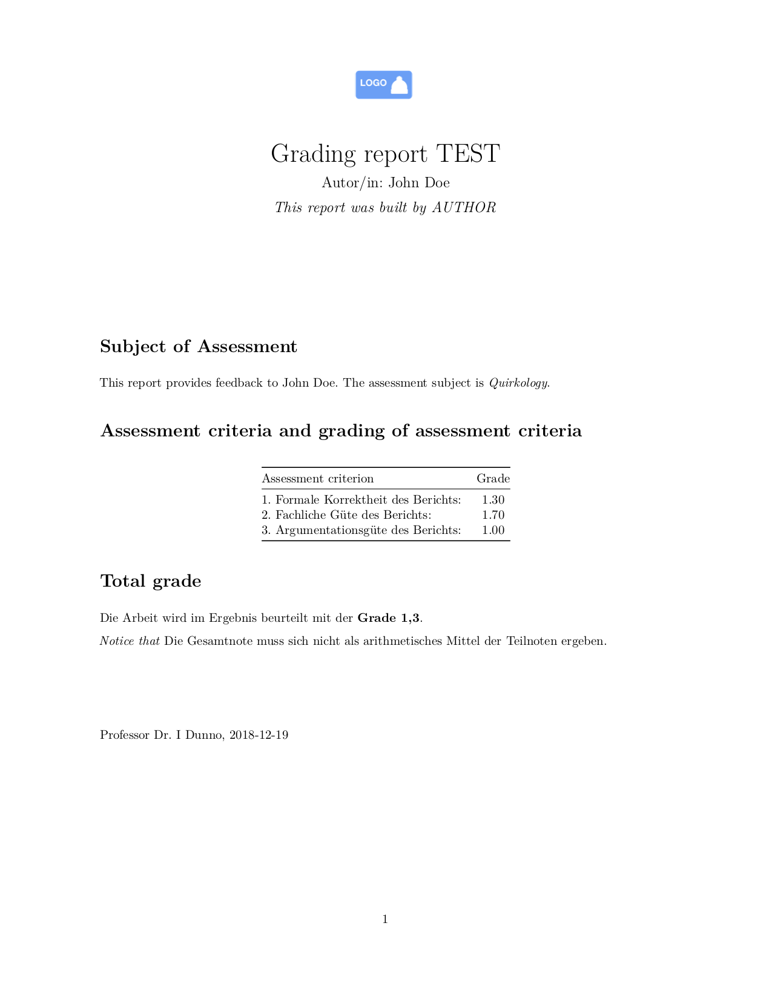

# rmd_mass_reports
Generating mass reports using Rmarkdown in R

## Purpose
This repo describes a way how to compile many similar reports using RMarkdown in R. 
Specifically, it is assumed that there's a tabular data, where each row is a document,
and each column holds the variables to appear in the reports. 
In addition, a template is provided where the variables are then parsed into. 
This template is built on latex, so that the output document is a pdf file.

## Installation and usage

1. Install R
2. Install LaTeX
3. Download/clone this repo
4. Set this folder as your working directory in R
5. Run `render_rmd_mass_report()` in `render_rmd_mass_report.R`, it is assumed that all files are in the same folder.

## Data file

`grades.csv` is a toy data file for illustration purposes.

## Templates

### `grading_template.Rmd`

This file is a simple RMarkdown file that holds the overall document. 

### `latex-header.tex`

This latex file holds the Latex backbone for the Rmarkdown template. Notice that `dummy_logo.png` is read (and assumed to be in the same folder).

## Adjusting

Feel free to adjust to your needs. You need to make sure to change the variables in all sources:

- data file
- Rmd template
- render function `render_rmd_mass_report()` in `render_rmd_mass_report.R`

## Example

