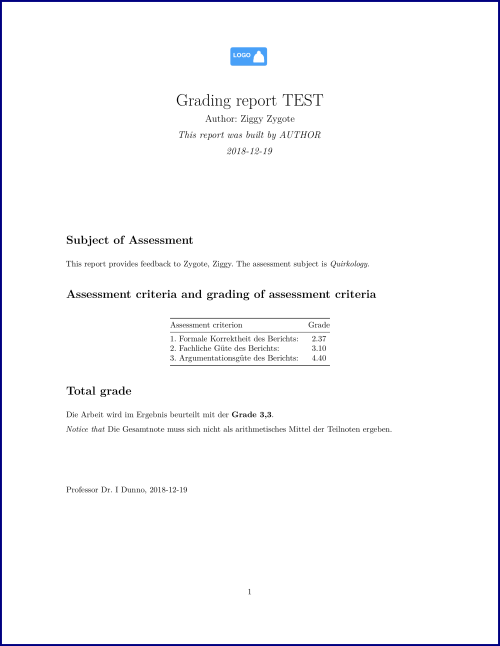

# rmd_mass_reports
Generating mass reports using Rmarkdown in R

## Purpose
This repo describes a way how to compile many similar reports using RMarkdown in R. 
Specifically, it is assumed that there's a tabular data set, where each row is a document 
(eg., a mail or report to one given person), 
and each column holds the variables to appear in each reports (see examples below).
In addition, a template is provided where the variables are then parsed into. 
This template is built on latex, so that the output document is a pdf file.

## Installation and usage

1. Install R
2. Install LaTeX
3. Download/clone this repo
4. Set this folder as your working directory in R (or define it as a RStudio Project)
5. Run `render_rmd_mass_report()` in `render_rmd_mass_report.R`, it is assumed that all files are in the same folder.

## Data file

`grades.csv` is a toy data file for illustration purposes. It consists of two rows (two reports) with three variables.

You need to supply a data file; the data files stores the grading data for each student.

The data file is of type csv (use UTF-8 encoding), and the following columns are expected:

- Firstname (eg., "John", type string)
- Name (eg., "Doe", type string)
- crit1 (first grading criteria, eg., "beauty of style", type string)
- crit2
- crit3

If you need to change the number of criteria, you'll need to adapt the main R function (see below).

## Templates

### `grading_template.Rmd`

This file is a simple RMarkdown file that holds the overall document. 

### `latex-header.tex`

This latex file holds the Latex backbone for the Rmarkdown template. Notice that `dummy_logo.png` is read (and assumed to be in the same folder).

## Adjusting

Feel free to adjust to your needs. In many cases it may suffice not to touch the latex file. You need to make sure to change the variables in all sources:

- data file
- Rmd template
- render function `render_rmd_mass_report()` in `render_rmd_mass_report.R`

## Other stuff

`render_example_images.R` is a helper file in order to render the examples images (from pdf to png).

## Example

  

